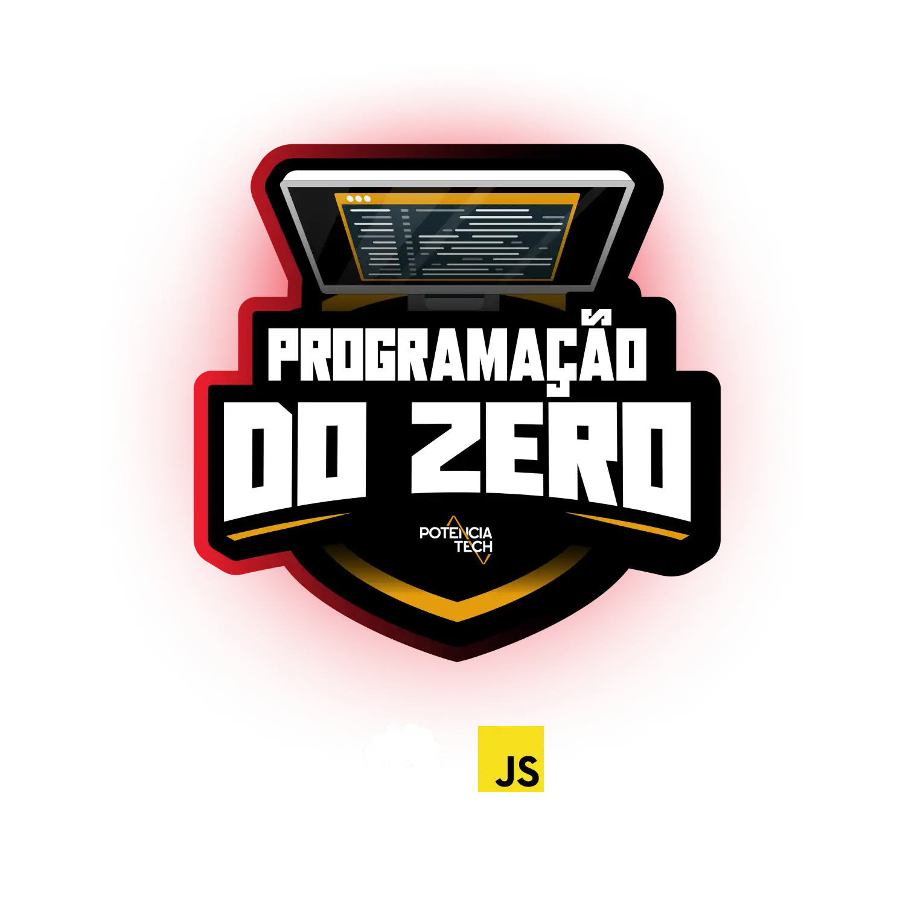

Bem vindo!
 Este repositório é destinado ao conteúdo do
<h1></h1>
Bootcamp Potência Tech iFood   < Programação do Zero /></h1>
<!-- <h3>Andamento do Processo:</h3>
 -->
<!-- https://github.com/leticiapalaro/Bootcamp-Potencia-Tech-powered-by-iFood/tree/main -->

# #1 Princípios de Desenvolvimento Ágil e Colaborativo

- [X] Bootcamps DIO: Educação Gratuita e Empregabilidade Juntas!
- [X] Trabalhando em Equipes Ágeis
- [X] Versionamento de Código com Git e GitHub
- [X] Desafios de Projetos: Crie Um Portfólio Vencedor
- [X] **Contribuindo em um Projeto Open Source no GitHub**

 

# #2 Introdução a Lógica de Programação

- [X] Introdução aos Conceitos Básicos em Lógica de Programação
- [X] Entendendo Algoritmos e Fluxogramas
- [X] Estrutura de um Software e Seu Ambiente de Desenvolvimento
- [X] Trabalhando com Variáveis
- [X] Criando e Manipulando Vetores e Matrizes
- [X] Parabéns Por Dominar os Conceitos Básicos

 

# #3 Explorando Operadores

- [X] Introdução ao Mundo de Operadores De Programação
- [X] Entendendo Operadores e Expressões
- [X] Trabalhando Com Operadores Aritméticos
- [X] Trabalhando Com Operadores de Comparação
- [X] Trabalhando Com Operadores Lógicos
- [X] Parabéns Por Dominar Os Operadores

 

# #4 Dominando Estruturas de Controle

- [X] Introdução as Estruturas de Controle
- [X] Trabalhando Com Estruturas Condicionais (if, else if, else)
- [X] Trabalhando Com Estruturas de Decisão (Estrutura Switch Case)
- [X] Trabalhando Com Estruturas de Repetição (for, while, do-while)
- [X] **Desafio:** Classificador de Nível de Herói [Clique aqui para acessar o Código.](https://github.com/htonioni/javascript-dio._/blob/main/desafios-de-projeto/nivelHeroi.js)
- [X] Parabéns Por Dominar as Estruturas de Controle

 

# #5 Trabalhando com Funções

- [X] Introdução ao Mundo de Funções
- [X] O Que São Funções e Como Criar
- [X] Funções com Parâmetros
- [X] Funções com Retorno
- [X] **Desafio:** Calculadora de Partidas Rankeadas [Clique aqui para acessar o Código.](https://github.com/htonioni/javascript-dio._/blob/main/desafios-de-projeto/calculadoraPartidas.js)
- [X] Parabéns Por Dominar Funções

 

# #6 Aprimorando Sua Lógica de Programação com Desafios de Código

- [ ] Desafios de Código: Aperfeiçoe Sua Lógica e Pensamento Computacional
- [ ] **Desafio:** Manipulando Variáveis com JavaScript [Clique aqui para acessar o Código.]()
- [ ] **Desafio:** Dominando Operadores com JavaScript [Clique aqui para acessar o Código.]()
- [ ] **Desafio:** Explorando Condicionais com JavaScript [Clique aqui para acessar o Código.]()
- [ ] **Desafio:** Praticando Laços de Repetição com JavaScript [Clique aqui para acessar o Código.]()
- [ ] **Desafio:** Dominando Funções com JavaScript [Clique aqui para acessar o Código.]()

 

# #7 Estruturas de Dados e Objetos

- [ ] Introdução Ao Mundo Dos Objetos
- [ ] Estrutura de Dados JSON
- [ ] O Que São Classes e Objetos
- [ ] **Desafio:** Escrevendo as Classes de Um Jogo [Clique aqui para acessar o Código.]()
- [ ] Parabéns Por Dominar as Estruturas de Dados
- [ ] Avalie o Bootcamp Potência Tech iFood

 

    <h1># Bootcamp Concluído!</h1>
    
     
    
     

